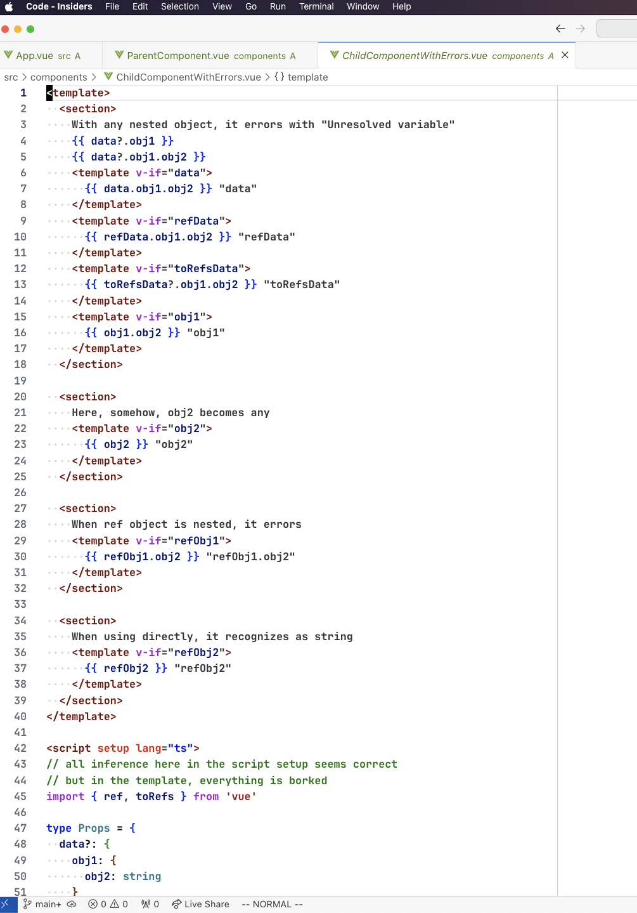

# jetbrains-vue-ts-errors-sample

just npm install, and make sure the Volar extension is installed.

in any jetbrains IDE (including WebStorm 2024.1 EAP @next), the ChildComponentWithErrors.vue component has template inference completely broken.

it works perfectly on VS Code, btw.

